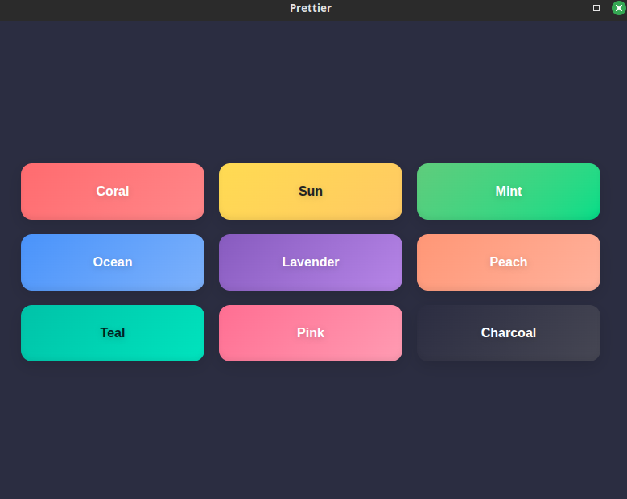

# FSharp.WebUI

F# binding for [WebUI](https://github.com/webui-dev/webui) - Use any web browser as GUI.



## Installation

`dotnet add package FSharp.WebUI --version 0.0.1`

## Project Structure

```
fsharp-webui/
├── fsharp-webui.fsproj          # Library project
├── src/
│   ├── Bootstrap.fs             # Native bootstrap + cache + SHA256 verification
│   └── WebUI.fs                 # Main library code
├── buildTransitive/
│   ├── FSharp.WebUI.props       # Default bootstrap properties
│   └── FSharp.WebUI.targets     # Build-time bootstrap target
├── tools/
│   └── WebUI.Bootstrapper/      # Tiny managed helper invoked by MSBuild
├── examples/
│   ├── simple-example/          # Runnable example
│   ├── prettier/                # Pretty CSS buttons example
│   └── reflection/              # Reflection example (embedded resource loader)
└── tests/
    └── WebUITests/              # Simple test build
```

## Supported Platforms

Nightly upstream assets currently used:
- Linux x64 → `webui-linux-gcc-x64.zip`
- Linux ARM64 → `webui-linux-gcc-arm64.zip`
- Linux ARM → `webui-linux-gcc-arm.zip`
- macOS ARM64 → `webui-macos-clang-arm64.zip`
- macOS x64 → `webui-macos-clang-x64.zip`
- Windows x64 → `webui-windows-msvc-x64.zip`

## Build Commands

### Library
```bash
dotnet build fsharp-webui.fsproj
```

### Example Applications

Simple example:
```bash
dotnet run --project examples/simple-example
# or
dotnet build examples/simple-example/simple-example.fsproj
./bin/Debug/net10.0/simple-example
```

Prettier (3x3 pretty buttons) example — default browser: Chromium:
```bash
dotnet run --project examples/prettier
# or
dotnet build examples/prettier/prettier.fsproj
./bin/Debug/net10.0/prettier
```

Reflection (embedded resources) example — reads index.html and App.css from assembly resources:
```bash
dotnet run --project examples/reflection
# or
dotnet build examples/reflection/reflection.fsproj
./bin/Debug/net10.0/reflection
```

Note: examples use WebUI.Browser.Chromium by default in their sample code; change to another browser by passing a different Browser enum to WebUI.showBrowser if desired.

### Tests
```bash
dotnet run --project tests/WebUITests
# or
dotnet build tests/WebUITests/WebUITests.fsproj
./bin/Debug/net10.0/WebUITests
```

## Usage Example

```fsharp
open WebUI

let html = """<!DOCTYPE html>
<html>
  <head>
    <script src="webui.js"></script>
  </head>
  <body>
    <button id="myBtn">Click Me</button>
  </body>
</html>"""

[<EntryPoint>]
let main argv =
    let myWindow = WebUI.newWindow()
    WebUI.bind myWindow "myBtn" (WebUIEventHandler(fun _ -> printfn "Clicked!"))
    WebUI.showBrowser myWindow html WebUI.Browser.Chromium |> ignore
    WebUI.wait()
    0
```

## Native Bootstrap (Nightly)

Native binaries are **not redistributed** in this package. They are downloaded from WebUI nightly releases on first use/build, verified with SHA-256, and cached per user machine.

Default release tag:
- `nightly`

Cache locations:
- Windows: `%LocalAppData%/fsharp-webui/nightly/<asset>`
- Linux: `${XDG_CACHE_HOME:-~/.cache}/fsharp-webui/nightly/<asset>`
- macOS: `~/Library/Caches/fsharp-webui/nightly/<asset>`

Refresh and overrides:
- MSBuild refresh: `WebUIBootstrapRefresh=true`
- Environment refresh: `WEBUI_BOOTSTRAP_REFRESH=true`
- MSBuild native override: `WebUINativePath=/path/to/native`
- Environment native override: `WEBUI_NATIVE_PATH=/path/to/native`
- Optional tag override: `WebUIReleaseTag` / `WEBUI_RELEASE_TAG` (default remains `nightly`)

## Smoke Test Script

Run bootstrap smoke checks locally:

```bash
./scripts/smoke-bootstrap.sh
```

Optional:
- `SKIP_NETWORK_TEST=1 ./scripts/smoke-bootstrap.sh` to skip the nightly download/verify test.

## Requirements

- .NET 10.0+
- A web browser (Chrome, Firefox, Edge, Safari, or Chromium)
- Network access to GitHub releases on first bootstrap (unless using native path override)
