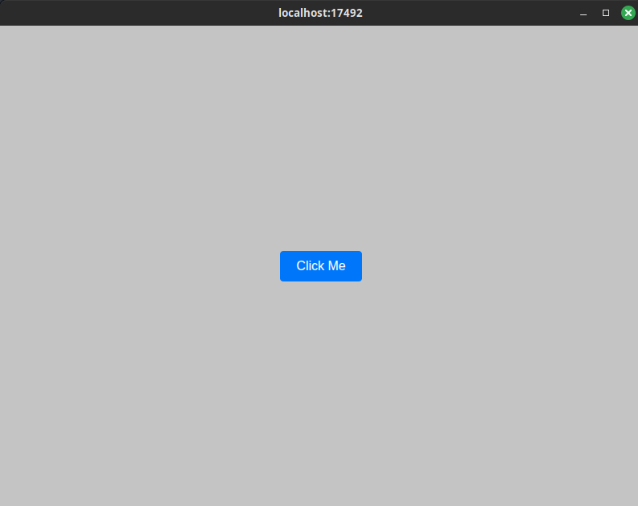

# FSharp.WebUI v2.5.3

F# bindings for WebUI — use any web browser as a GUI.


WebUI lets applications use a real web browser as the user interface while keeping the host program lightweight. This repository contains F# bindings and helpers that integrate WebUI with .NET applications.

WebUI repo: https://github.com/webui-dev/webui

## Features

- Portable (needs only a web browser at runtime)
- Lightweight (small library, low memory footprint)
- Fast binary communication protocol between host and frontend
- Multi-platform & multi-browser support
- Uses a private browser profile for safety
- Native runtime provided by WebUI (downloaded on first use or supplied manually)

## Installation

`dotnet add package FSharp.WebUI --version 2.5.3`


## Supported platforms & upstream assests:

- Linux x64 → `webui-linux-gcc-x64.zip`
- Linux ARM64 → `webui-linux-gcc-arm64.zip`
- Linux ARM → `webui-linux-gcc-arm.zip`
- macOS ARM64 → `webui-macos-clang-arm64.zip`
- macOS x64 → `webui-macos-clang-x64.zip`
- Windows x64 → `webui-windows-msvc-x64.zip`

## Build commands

### Library

```bash
dotnet build fsharp-webui.fsproj
```

### Example applications

#### Simple example

```bash
dotnet run --project examples/simple-example
# or
dotnet build examples/simple-example/simple-example.fsproj
./examples/simple-example/bin/Debug/net10.0/simple-example 
```

#### Prettier CSS example


```bash
dotnet run --project examples/prettier
# or
dotnet build examples/prettier/prettier.fsproj
./examples/prettier/bin/Debug/net10.0/prettier
```

#### Reflection example — embeds assembly resources


```bash
dotnet run --project examples/reflection
# or
dotnet build examples/reflection/reflection.fsproj
./examples/reflection/bin/Debug/net10.0/reflection
```

Note: the examples use WebUI.Browser.Chromium by default in their sample code; change to another browser by passing a different Browser enum to WebUI.showBrowser if desired.

#### Tests

```bash
dotnet run --project tests/WebUITests
# or
dotnet build tests/WebUITests/WebUITests.fsproj
./tests/WebUITests/bin/Debug/net10.0/WebUITests
```

## Usage

### Simple program

```fsharp
open WebUI

let html = """<!DOCTYPE html>
<html>
  <head>
    <script src="webui.js"></script>
  </head>
  <body>
    <button id="myBtn">Click Me</button>
  </body>
</html>"""

[<EntryPoint>]
let main argv =
    let myWindow = WebUI.newWindow()
    WebUI.bind myWindow "myBtn" (WebUIEventHandler(fun _ -> printfn "Clicked!"))
    WebUI.showBrowser myWindow html WebUI.Browser.Chromium |> ignore
    WebUI.wait()
    0
```

### Info

#### Native bootstrap (nightly)

Native binaries are not redistributed in this package. They are downloaded from WebUI nightly releases on first use/build, verified with SHA-256, and cached per user machine.

Default release tag: `nightly`

#### Cache locations:
- Windows: `%LocalAppData%/fsharp-webui/nightly/<asset>`
- Linux: `${XDG_CACHE_HOME:-~/.cache}/fsharp-webui/nightly/<asset>`
- macOS: `~/Library/Caches/fsharp-webui/nightly/<asset>`

#### Refresh and overrides:
- MSBuild refresh: `WebUIBootstrapRefresh=true`
- Environment refresh: `WEBUI_BOOTSTRAP_REFRESH=true`
- MSBuild native override: `WebUINativePath=/path/to/native`
- Environment native override: `WEBUI_NATIVE_PATH=/path/to/native`
- Optional tag override: `WebUIReleaseTag` / `WEBUI_RELEASE_TAG` (default remains `nightly`)

#### Bootstrap testing

```bash
./scripts/smoke-bootstrap.sh
```

##### Optional:
- `SKIP_NETWORK_TEST=1 ./scripts/smoke-bootstrap.sh` to skip the nightly download/verify test.

#### Supported web browsers

- Chrome
- Chromium
- Firefox
- Edge
- Safari
- AnyBrowser (automatic selection — let the native runtime pick the best available browser)

#### Requirements

- .NET 10.0+
- A web browser (Chrome, Firefox, Edge, Safari, or Chromium)
- Network access to GitHub releases on first bootstrap (unless using native path override)

#### Documentation

- WebUI repo: https://github.com/webui-dev/webui
- WebUI core documentation: https://webui.me/docs

## License

Licensed under the MIT License.
